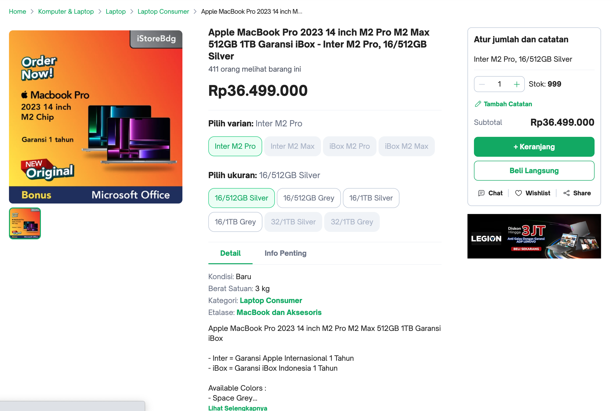

# Soal test maggang Backend engineer dengan Springboot

Berikut adalah soal/pertanyaan yang perlu dijawab oleh peserta maggang

## knowledge base

1. Apa yang anda ketahui tentang Rest API?
2. Apa yang anda ketahui tentang Server side and Client side processing?
3. Apa yang anda ketahui tentang Monolith dan Microservices, berikan contohnya?
4. Apa yang anda ketahui tentang Design pattern inversion of Control serta Dependency Injection?
5. Apa yang anda ketahui tentang Java programming dan Spring framework khususnya spring-boot?

## Design modules

Dalam suatu schenario ada requirement membuat aplikasi e-commerse seperti Tokopedia seperti berikut:

1. Catalog, pelanggan mencari product di toko
    
2. Item, bisa melihat detail informasi produk
    
3. Cart, pelanggan bisa menambahkan produk yang ingin di beli ke keranjang
    
4. Setelah di checkout, masuk ke list transaction
    
5. Kita juga bisa liat detail transactionya
    

Kemudian temen-temen buat design database, module (monolith/microservices) berdasarkan gambar atau schenario tersebut. Serta jelakan mengapa menggunakan design tersebut.

## Praktek

Berdasarkan analisa tersebut, buat project monorepo (pada repository ini) dengan menggunakan framework springboot seperti berikut specifikasinya:

- Database: `PostgreSQL 15`
- JDK version: `Oracle JDK 17 or later`
- Springboot version: `3.0.x`

terkait design system Toko, Barang, Pembelian pada ecommerse tersebut.

## jawaban knowledge base
1. Rest API adalah interaksi antara frontend dan backend yang dimana untuk  dapat mengambil data user, memposting data baru, memperbarui informasi juga menghapus data tertentu.

2. Server side processing adalah bagian pengembangan dari sisi server yang dimana proses tersebut dilakukan sebelum data dikirim ke klien contohnya otentikasi user juga pemrosesan database. Sedangkan Client side processing adalah proses yang dilakukan oleh perangkat user di browser web contohnya validasi form.

3. Monolith adalah aplikasi besar tunggal dengan semua komponen saling terhubung. Contohnya Aplikasi e-commerce tunggal yang mencakup semua fitur dari katalog produk hingga pembayaran. Sedangkan Microservices adalah kebalikan dari monolith yaitu aplikasi yang layanannya dibagi menjadi lebih kecil dan spesifik. Contohnya Netflix dengan layanan terpisah untuk konten, rekomendasi, otentikasi, dan pencarian.

4. Inversion of Control (IoC) adalah sebuah desain konsep dimana kontrol eksekusi program tidak ditentukan oleh program itu sendiri, tetapi oleh kerangka kerja atau kontainer yang menyediakan layanan. Sedangkan Dependency Injection (DI) adalah teknik implementasi dari prinsip Inversion of Control (IoC) di mana kelas menerima objek-objek yang dibutuhkannya (dependensi) dari luar.

5. Java Programming adalah bahasa pemrograman tingkat tinggi yang platform-independent, dengan sintaks mirip C++. Sedangkan Spring Framework adalah kerangka kerja aplikasi Java yang luas digunakan untuk pengembangan aplikasi enterprise. Spring Boot adalah proyek dalam keluarga Spring yang menyederhanakan pengembangan aplikasi Spring dengan menyediakan konfigurasi default dan pemilihan opini yang didorong secara otomatis. 

## Design

Database direncanakan dengan tiga tabel terpisah: "product_transaction" untuk mendokumentasikan detail transaksi, "product" untuk menyimpan informasi produk, dan "transaction" untuk mencatat informasi umum tentang setiap transaksi. Koneksi antar tabel dijembatani melalui kunci asing, "product_id" dan "transaction_id". Dengan desain ini, memungkinkan pemisahan entitas dan menjaga konsistensi data, memudahkan pengelolaan dan skalabilitas sistem. Dengan memisahkan transaksi dari detail produk dan informasi produk, desain ini mendukung pendekatan modular dalam pengembangan mikro layanan, di mana setiap layanan dapat fokus pada tugasnya sendiri tanpa ketergantungan yang berlebihan pada struktur internal lainnya.

## Praktek

